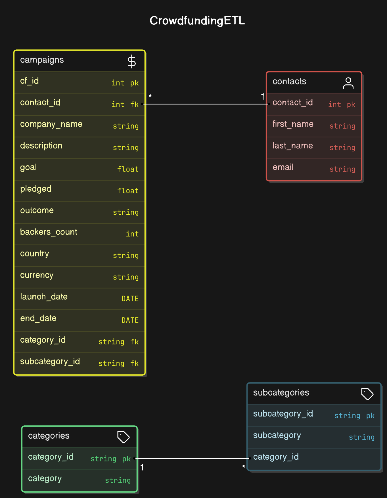

# Crowdfunding ETL Project

## Overview

This project demonstrates an ETL (Extract, Transform, Load) pipeline using Python and Pandas to process and transform crowdfunding and contacts data from Excel files. The data is extracted, transformed, and loaded into a PostgreSQL database. The primary objective is to create normalized tables for categories, subcategories, campaigns, and contacts, and ensure proper relationships among the data. Additionally, we use CSV files for the final output and schema creation.

## Project Structure

The repository contains the following key files:

* `ETL_Mini_Project_JMancheno_SKhatri.ipynb`: The main Jupyter notebook that contains the complete ETL process, including data extraction, transformation, and CSV file creation.
* `Resources/`: Contains the original Excel files used for data extraction.
  * `crowdfunding.xlsx`: Data for crowdfunding campaigns.
  * `contacts.xlsx`: Data for contacts associated with campaigns.
* `category.csv`: Extracted and transformed category data.
* `subcategory.csv`: Extracted and transformed subcategory data.
* `campaign.csv`: Transformed campaign data, including details like goals, backers, and timelines.
* `contacts.csv`: Cleaned and formatted contact details extracted from the contacts file.
* `crowdfunding_db_schema.sql`: PostgreSQL schema file used to create the database and corresponding tables.
* `ERD Diagram.png`: Entity-relationship diagram (ERD) showing the database structure.

## ETL Process

### 1. Data Extraction

We extract data from two Excel files:

* `crowdfunding.xlsx`: Contains information about crowdfunding campaigns.
* `contacts.xlsx`: Contains contact information associated with the campaigns.

### 2. Data Transformation

* **Category and Subcategory DataFrames** : We extract category and subcategory titles, create unique IDs for each, and store them as DataFrames. These DataFrames are saved as `category.csv` and `subcategory.csv`.
* **Campaign DataFrame** : The campaign data is transformed by converting columns such as "goal" and "pledged" to floats, formatting UTC timestamps into human-readable date formats, and linking each campaign to the corresponding category and subcategory using unique IDs. The result is saved as `campaign.csv`.
* **Contacts DataFrame** : Using Python dictionary methods, we extract contact details, split names into first and last names, and create a clean DataFrame. This DataFrame is exported as `contacts.csv`.

### 3. Data Loading

The transformed CSV files are loaded into a PostgreSQL database with a normalized schema. The schema includes foreign key relationships to link categories and subcategories to campaigns, and contacts to campaigns.

## Database Schema

We designed a normalized database schema based on the data transformations, represented in the ERD diagram. The schema consists of the following tables:

* `categories`: Contains category information.
* `subcategories`: Contains subcategory information.
* `campaigns`: Contains detailed campaign data, linked to `categories` and `subcategories`.
* `contacts`: Stores contact information associated with campaigns.

### ERD

### Table Schema

The schema includes primary keys for each table and foreign key constraints where applicable. Data types and constraints are specified in the `crowdfunding_db_schema.sql` file.

